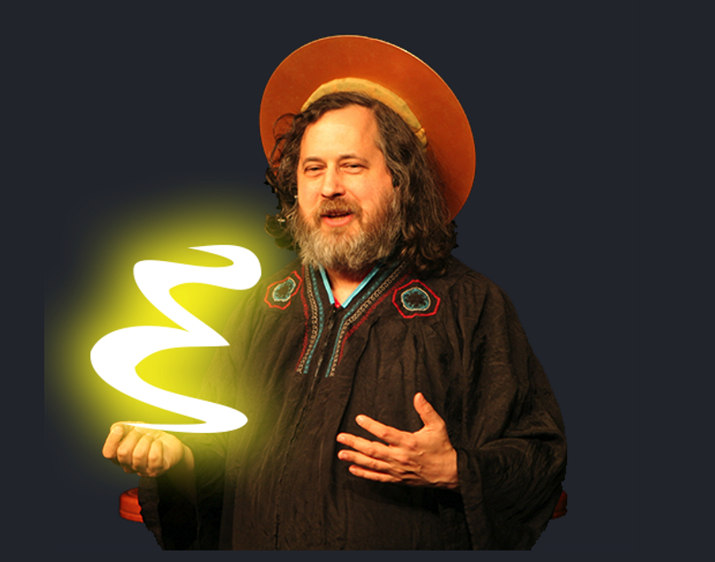

# FreakScheme: A Scheme Interpreter in Haskell

A Scheme interpreter written in Haskell, work in progress,

Welcome to FreakScheme, where the charm of Scheme meets the power of Haskell,
following the original insights of Adam Wespiser, and his legendary "Write You A
Scheme, Version 2.0."

Eventually, I will use the experience of this project for more specific DSL interpreter projects.

## Inspiration

> F̴̡̨̧̨̢̧̧̧̨̛̥͇̪͖̼̻̗̣͉̬̳͙͖̗̳̤̖͕̙͕̩̘̗̬̜͈̝̩͈̜̗͓̬͕̦̰̞̦̱͈͔̱̟̺̘̟̣̙̩͎͔͚̩̬̮̝̼͔̗̪̳̤̞͕̲̤̥̞͇̪̩̗̱̤͖̠̲͕͈̳̫̖͙̲̙̫͈͉͙͕̜͚̝̰͉͕̳͈̬͈͉͈̟̝̯̱̬̪͌́̈́̅̓̓͐̏̉̈́͛͆͐͋͛̋̓̿͆́͊͐͑͐̀͊̆̄̃͋̉͛̽̅̌̽̂̋͒́͌̑̃̉̅̊̈́̐̌͗̕̕̕͜͠͠͝͝ͅͅè̴̢̢̢̧̢̢̧̧̢͖̙͍̮̙̯̯̖̠̭̝͕̠̞̼͉̠̠̭̗͈̯̭̱̮̖̫̤̲̣̯͙̭͔̜͈̤̻͓̬̞̪͉̺̣̜̭͈̗̞̟̟̫͉͈̼̘̺̲͈̥͚̜̪̟̏̈̄̌͑̑̉̄̃͑̾̚̕̕͜͝͠ͅȩ̴̛̘͍͓̍̐̆̈́͑̋̋́̒̔͒̎̏͗̃̂̓͂̋̀͋́̈́̔͋͂̚͘͘̚͝ͅl̸̡̡̧̧̧̡̧̢̛̛̛̯̞̠͕͙͈̤̬͈͈̰͇̼̩̦̫͔̬̙̮͙̰̣̘̜̳̩͙̪̝̹̙͉̺̣̪̖̮̭̯̻͎̮̞̗̮̫̰̦̹̥̣̘͔̘̹͍͇͙̼̣̜̞̳̭̥̗̟̯̯͍̰̙̼̣̟̮̯̥̝̫͔̙̥̟̤̐͒̓̏̐̏͑̅̅̈́͌̄̑͐̿̔͋̋̊̆̄́̑̈̽̉̐̏͒̒͆͛̊̾̌̈͌̐̒̈́́͜͜͝͝͝͠ͅi̸̢̢̡̭̬̹̝̱̤̥͉͔̝̞̭̍̽̋͐͜ͅņ̷̢̧̢̢̢̨̡̢̡̛͈̞̞̮̦̣̻̘̗͈̻̺̫̗͍̦̭̹̠͇̝̦͇̳̻̫̙͇̻̪̦̹̖̱̩̩͙̮̫̗̩̺̳̞͔̙̫̹̗̣̫͈̜̳̺̪͉̻̣̘̠̬̗̝̞̦̪̼̝̠̝̝͙̤̟̻̍͌̔͆̾͊̈̄́̆̈́̓̊̈́͆̆̈́̇̓̾̎̅̓̋̆̊̑̍͌͋̐͐̾͑̃̈́̀̓̈́͋̀̀̾͋̄̏͊̾̀͑͒͊́̇͒͛́͆͐̇̽̓̓͘̕͘̕͘͜͜͠͠͠͝͝ͅ´̴̨̛̯̞̟̘͍̈́̅̾̂͒̽̾̐͂̋̀̈̒̎̓͛̓̀̂̍̐̏͂̎́̌̓͊̈́̈́̄̓̃́͌̒̄͗̇͐͐̎̄̒̈̈́͂̈́̔̈́͊̋̓̉͂̈́̀̐͒̌̎̈́̌̊̐̅̓̄͆͆̚̚͘͘̚̚͘̕̕̚͘͠͝͝͠͝͝͠͝ ̵̨̧̨̢̡̨̛̛̠̙̼̯͓̙̦̞̫͔̱̼͙̖̪̖̝̲̘̱̠̯̤̤͍͎̩̞̘̫̮̮͚͚̝̙̝͔̘̼͓͍͖̭̦̞̝͈͚̫͕̟͇̠̏͐̑̏̿̃̿̒͋͊̑̈́̈́̔̂̍̆͌̃͛̈́̄̉̔̓̏̆̒̑̆̽̂̄̌̾̈̔̈́̍̆͒̈͗͊̒͆̃̈́̆͂̄͐̑̋̈́͋̓̋̋͗̓̆͌̊̓̈́̈̉́͛̌̑͒̾̄͑̑̈̂̽̉̂̈́̈́͊̓̊̔̓͊̃͛̐̓̂̾̊̅̃̈́͋͘̚̚̕͘̚̚̚͝͠͝͠͠͝͝͝͝͝͠͝ͅͅͅl̴̢̡̡̧̛̠̺͓̩͉̥͔̣̼͖͍̱̣̗̞͙͕̬͍͇͇͙̩͔͇̗̗̣͕̽̓̃̓͆̆̈́̂̈̅̇͗͑͊̌̈́̔̒̀̂̃̀̏̽̄̓̔́̆̈́̍̀̔̽̚̚̚̕͠͠͝͠i̶̧̨̨̧̡̧̡̢̢̛̛̛̛̳̥̱͎̣͓̼̺͔̥͎͓̝͔͇̠̖̤͉̬̞̭̻̣̳͚̺̤͎̬͓͔̱̞͎̺̹̜̙̠͖̮͉̪̥̤̮̗̩̻͎̩̞̲̩̣͉͔̣͍̩̪̞̖̰̫̝͚͇͉̲̻̼͎̬̝̗̞̩͎͍̬͓̬̬͉̥̬͙̯̹̓̔̎̾͑͂̐͒̓̅̉̒̓̿̉̃́͆͐͆̀͗̊͗̿͆̾̓͑́̄́̄̂͑̍́̀̋͛̉͒̀̇͘͘͜͜͜͜͜͠͠͝͠͝ͅk̸̡̡̨̢̡̡̨̨̜̱̤͖͍̰͔͇̠̼̟̙͖͖͎̬̳̼̺̟̼̜̩̝̩̙̥̱̟̭̯̪͖̟͍͓̠̯̪̲̱̹̖̝̙̥̫͕̯̭̣͙͔͇͎̟͇̠̰̥͓̗̩͔̣̰͉͉̼͕͍͈̦̮̫͖̱͖̗̙̗̤͍̫̺̙̟̥͊̉̔͌̈́̉̇̈́̐̾̍͛́̊̃͐̊̔͗̂͒͌͋͐̃͌̅̓̓̔͐͛̐̎̏̋̀͐̅͌͋͊͐̐̓͂̆̔̎̂̒̀̓͆̈́̊̑̇̆̽͑͂̌͒̑̃͗̇̆̃̀̊̍̈́͑͗̆̚̚̚̚̚͘͜͝͠͝͠͝͠͝͝͝ͅͅͅͅȩ̷̧̳͉̰̩̗͈̦͙̦̪͉̓͐͑ ̵̡̡̨̢̧̛̛̛̛̘̤̺͍̜̲͎̳̮̟͚̝̹̠̭͓̝̜͉̳͂́͗̓̆̾̒̎̀͊͌̈́͒̽͌̆͋̄͌͆̈́̓̾̆̀̅͆͐̂̓̌̆̓̃̀̋̉̀̾̏͗̊͋̂̈́̎̐̐͒̑͂̿͋̋̈́̈̈́̔̅̾̈̎̓̾̊̅̆̈͊̃̈́͑̂͛̑̊͋͐̿͊̔̿̎̍̏͘̚͘̕͘͜͝͝͠͝͠͝͠ă̶̢̨̨̡̡̛̛̛̮̩̖̰̺̬̩͈̮̯̘̦̯̫̙̲̜͎̠͖͕̩̺̣̙̱͖̤̥̯̗̦͖̙͚̥̻̤̪̬͉̓̂͆̏̔͆́̓͗̑́̅͗̆̎̀̈́̆̆̄̆̑̎̈̊̓̉̂̈́̑̓̅͒͋̀̈́́̀͒̈́͂̄̆̄̉͋̊̀̋̈͐̄̅͗͑̄͆̇̓͛͌̀̆̆͌͊̉̋͛̚͘̚̕̕͘͜͜͠͠͠͝͝͝͝ͅͅͅ ̴̢̡̨̢̨̡̢̢̰̲̼̘͔̣͖̱̭͈̦̳̭̥̳̰̳̹͎̯̘͖̯̼̹̩̺̜̭̹̥̞̘͍͕̭͚͉͎̻̟̣̹̫͈̩̳͈͕̣̝̲̘̝̦̠̩̠̼̬̯̪͕͓̺̺̣̝̞͉̣͉̖͈̹̖͙͉͚̬̘̮̝͎̼͙͍͍̳̥͇̮͕̦͖̭̬̼̻̹̗̻͂̾̒̓̉͆͒̏̓͒̉̈́̆̅̋̎̈̋̐̆̃̊̆̌̈́̆̈́̆̒̓͛̊̀̂̐̎͆̈̈́̈̐͂̀̈͋͛̍̃͑̒̕͘͜͜͜͝͝͝͝ͅͅͅͅf̶̢̨̡̢̢̛̹̩͇̬͎͕̫̗̗͉͔̜̞͚̰̝̰͔͍͇͙̣̲̼̙̘̲̯̠̖̭̩̱͕̯̤̣̠̥̿͒͐̈́́͆͐̂̍̑̍̋̓̔́̇̀͑͆̽́̽̒̇̔̇̊̊̔̉͂̽̈́́̔̔̋́͗͆́̈́̃̈́͆̓̓̅̆͒͐͋̿̋̍͊̆͊̒̌̽̊͊̕͘̕͘͘̕͜͝͝ͅr̴̛̛̮̞̙̺͍͚̝̍̇́̑͋̍̏͊̃̐͛̐͒̄͂̈́̽̇̿͗̓̔͒̾̔̇͌̋͒̏͗͋͂̌̂̈́́́͌͑̈̅̑͗͗́̆̐͛͆͒̓̊̏̍̆̆͒̐͗̔͋̈́̀͐͆̈́̈̊͑̀̋̄͐̑́̈́́͑̃̃̔̈́̿̏͋̍̎̅̇͛͆͗͐͊̒͛̆̐́̾͛͘̕͘͘͝͝͝͝͝͠͠͝͝͝͠ȅ̴̡̧̡̡̧̪͇̣̮̦̠̲̙̹̰͎̝̝͈̮͔̻̲̬̘̲͙̝̯̪̗̞̣̟̱̭̗͇̲̙̳̬̳͙̋̎̈́͂̒̏̃͒̿̈́̾̾̊͜͜͜͜ͅͅͅą̷̡̨̢̡̛̛̛̮̗̠̖̫̥̼̯̘̠̰̯͇̪̲͇̥̙̤̼̬̘͔͇̺̤̺̯̣̫͖̣̭̩̙͈̟̳̻̤̣̲̘̖̥̠̮̯͇̺̱̤̺̣̫̜͈̜̙̩͎͔͙̱̞͔̘̟̳̱̖͚̻̖̝̪̲͉̠̤̪̻̭̬̥̼̱̜͙̮͖̯̩̻̻̫̫̒̓͂̆̏̑̏̾͋͆͗̔͒̂̉̈́̆͊́͑̉̀͌̈́̃̋̆̍̋̏̾̇͆͛͐́̔̉̃͐̅̂͆̈́̃͛̊̆̆̏̿̔̕̕͘͜͜͝͝͠͝ͅͅͅͅḵ̶̡̧̡̨̡̮̘̮̲͚͓̮̣̠͚̠̗͔͓̫͍̪͚̪̗̥̤̹͓̭͕͚̤̜̪̭̞͉̗̮̦͎͇̥͕͚͎̰̠͇͉̝̩͍̥̼̦̯̣̻͙̙̳̘̞̳̯̝͙̳̯̹̬͕͙͙͕̤̼̳̬̼̫̠͉̜̦̦̟̞̮̠̳̲̖̠̪͚͖̩̟̗͉̣͚̣̣̰͙̪͍̋̐͌͌̈̋̈́̃̃͘̚͜͜ͅͅͅ ̵̡̧̙̲̖̗̖͉̜͓̹͈̜͍͔̺͍̙̜̪͉̟̜͓̺̓̑͛̏̈́̿́̈́̀̿̎̔̈́̏͂̎̈́̾͒̂͗̈́͘̚̚͘̕͠ͅǫ̴̛̛̙͕̖̼̟͚̫̖̈̃̅̉͊͐̇̃̊͌̑͗̾̽̍͑̿̍̐͛̌͑̈́̄̑̽̏̇̈̒̽̄̾̈́͐͆́̑̽̏͆́͒̄̓̀̆̀̾̇̌̀̏͐̆̾̎͊̈́͗̒̑̑͐̀̔̆͌͗͒̌̆̅̈́̈́̿̉̈́͗̉̔̉̒̏̅̈́̓͌͛͌̑̀̕̚̕͘͘̕̚̚͘͘͘͠͝͝͝͝ͅn̵̢̢̧̧̢̧̡̛̛̛̛͎͖͙̖͓̭̱̝͕̻̘̼͖̺̺̲͚͉̟͔͓̳̭͎̪̤̲͕̳̝͈̻̼͉͓̙̠͎̫̘̗̱̫͙̂̈͑̒̋̈́̈́̐́̔̈́̈́͐̈́̉́̊̒͌̊̾̈́̃̽̿̄̽́́̃͛̀̉̀͊̇͌̈́̅̿̈́̒̏̊͋̾͑̔̉̃̆͆̄̈́̏̄̋̒̃̓̾̇̎̾͒̑̈̓̃̀̾̄̊͊̄͌̏̍̈̊̏̐̋̊̌̇͌̀̓̾͊̒̑̚͘̕̚͝͠͠͝͝͝͝͠͠͝͝ͅ ̴̧̢̢̢̢̢̡̨̛͔̲̮͖͈͚̖̘͍̥̦̺̞̣̮̬̣̭̘͉̟͚̭̮̰͎̞̳͙̩̫̬̤̦̫͎͚̯̙̘̤̥͚̳̖̲̫̮̺̩̻̫̳̩̩̗͕̤̣̺͚͓̞͉̠͈͔̼̗̀́̒̉́̎̽̈́̎̀̌̈́̾̈́̒̾̃̋͗̈́́̑̇́̾̈́͐̇̄͊̈́̄͌̾̊́̔̓̑̍̓̂́͒̆̉̆͒̒́̋̎̽̔̏̀̓̌̃̊͆̔̇̊̊͆͊̇̃̌͑̽̔͑̐̊́̆̿̽̇͊̏͌͂̿͆̋̓̀͆̕̕͘̚̚̚̚̕̕̚̚͜͜͜͜͠͠͝͝͝͝͝͝͠͠͝͠͝ͅͅa̸̛̛̛̛͈̖̝̥̙͇̟͚̤̥̜̭̩̠͈̠͇̯̩̣͕̗͔̙͈̠͔͍̘̖̜͖̺̻͕̞͔͉̥̪͔̫̖̦͉̤̯̺̼̜̱͉̞͉̼͕͂̃̄̊̇̉̈́̇͌̀̆̔͊̅̉̍̂͒͆̾͐͗͌̈́̈́̅̍͑͌̅̓̊̈́̓̈͋̈́͑̐͗̀̾̐̌̀̑̎̈́̊̓͛͂̓̉̈̎̾̉͊͑͑́̐̃̇̃̈́͒͑̎͐̇͗̾͒̔͐̐̒̄̒̾̆̔͂̅̓́͐̀̐̊̓̄̄̑͋̈́̏͒̈́̕̕̚̚͘̚̕͜͝͝͝͝͝͝ ̷̧̡̨̡͖̳͙͓̩͓̦̦͍̭͔̤̙̗̯̬̱͎͕̗́͗̋̄͐͋͐͐͊̄̽̐̈́͌̀̕͘̚͠͠ͅl̷̨̡̢̨̨̢̡̛̛̛̬̬̼̫̟͖̪̼͓͉̤̤̥̟̥̙̥̦͖̜̮̖̲̫̟̩̘̤̪̬̰͈̪̻͔̯͔̙͔̘̠͙̳͍̣̙̰͍̯̭͕̠̘͔͎̦̦͕̪̫̍̌̍̌̔͒̀̊͛̑̊̔̅̀̐͋̐̅̑̎̒̄̓̈́̃̓͐̽̈́͛̉̿͂́̔̈́̎̆͆͒̽͐̇̊̈̽̊́̊́̓͌̄̅̓̎̀̈́͋͑̎́̐̊͛̑̀̉̓̈́͒̑͗̎̆̚̚͘̚̚͜͠͝͝͝͠ͅͅͅę̵̛͚͎̼̲͇̣͇̆̄̓̒̃̒̆̏̑̀̓́̍͂́̄̈̒͑͆̓̓̈́̈́́͒̂̾́̐̏͆̽̔̈́́̕̚͘͝͝͝͝a̷̧̢̧̢̛̛̛̛̹̻̗̫̥͚̮̲͈̩̟̼̱͓̣͙̯̟̼̙̳̜̣̮̬̞͎͙̬̖̥͓̦̝̝̘͚̱͇͇͔̤͔͙̻̟̳̬̱̼̼̫̱͕̠͚̝͎̟͂̌̃̏͒̾́̑̊̓̃͆̾̄̌̓̆̎̃̌̂́̇̒͊̇͌̄́̉̎̈́̓́͐͛̉̌͗̀̽̈́̔̀͋̽͒̈́̑͛̅͒̈́̽͊̏͛̄̃́͛̅̋̅̌̊̈̑̈́̈́̎͊̃̌̉̾̀̒̆͘̕̚̚̚͘͝͝͠͝͠͝s̵̛̛̥͕̋̓̉̽͛̅͆̈̈́͒̔͗̌́̓͐̀̉̽̾͂͋̽̓̾̈́͋̈́͒̽̾͂͋́͂̀͂̀͌̒̾̊͆̓̀́̏̆̊͒̌̄̇̈́̉̂̇͐̉̌́̔͌͛͋̔̏͂̆̆̇̒̈́͊̂̐̚͘̕͝͠͝͠͝͝͝ḧ̷̨͎̪̳̰͇̯͙̮͖̰̖̻̻̙͈̬̱̝͎͚̏̓͑́̓̿̿́͑͆̃̀̌̎
> F̶̛̛͙͍͇͍̼̽̐̇́̈́͊͛̑̈̅́͆̐́̀̇̽̓̄̿̀̋̎̌̒̊̄̄͐̉͆́͛͂͛̑͆͂̃͒̋͌̈́͌͆̈́̓̇͗͐́̑̽̀͊͗̍͘̚̚̚̚͝͝e̸̢̢̡̧̡̨̢̛͓͎̥͖̪͔̻̘̙̗̻̻͕̹̠̖̠͓̳̞̬̯̦͇͔̹͖̱̖̲͉͍͕̙̺̫̻̙̭͕̭̠͇̺̿̊̉̍̂̔͌͛̅̊̉́̈́͋̒̀̀͆̉̐͊͌̑͂̉̂̃͛̆͗͊̌̑̄́͌̔̈́̃̔̓̑͗̐̑͒̾͒͆͌̍̇̿̚̚̕͘̚̕ȩ̷̛̛̜̺̻̞̲̾̇͒̾̇̓̆́̈́̅̒̉̓̈́̿̐̉̍͒̏̏͛̈́̿́̍̔̅̀͋͂̈́͛͊̅͐̈́͛̀͂̍͒̌͊̀̌̄̍̇̆̀̚͝l̶̛̞͎̩̪͚̬̙̪̰͇͖̜͉͔̖͑͊̊̐̄̒͆̉̍̀͐̒̃̇̊̋̎̓̓͂̄͂̎͗̇͑͆̐̈́̃̉̆́̐͂̑͋͑́̀̅̑̈̒̂̓̇́̌̈́́̉͝͝ï̸̡̪̮͈͙̤̗̯̭̦̪͍̤̼͔̤̪̳̺̼̼̮̘̟̟̗͍͊̇͗͂̇̋̂̚͠n̸̢̡̛̛̛̗̳̗͈̹̤͉͔͕͈̲͙̬͖̠͖̎́͂̿͗̄̇̑̃̈́̋̋͐͛͋̽͒̽̉̎̉̈̔̅͂́̈́̒̐͋͒̇̑̋̓̅̍̄̐̈́̌́̂̿̏̓͐̃͑̃ͅg̴̢̡̝̺͕̩͓̣̮͇̳̬̤̱̩͚̣̲̠̬͐̇̀̅̽̇̾̄̀̀̃̀̒͆͑̀̾̀̅̋̎͆̏͌̓̊̃̈́̿͠͝ ̵̛̦̰͙̮̓̾͑̈́͊̓͆͑́̓̅̽͊͐͆̀̎͛̽͌͐̀̍̽͊̈́̌͛͊͐̾̿́̽̎́͊͌̎͐̎̀̊̀̎̀͊͒͌͌̇̕͝͝͝͝l̸̡̢̼̠̭̥̙̝̲̟̺̬͔̺͉̯̪̮̜̼̼̫̫̘̝̩̤̩̘̝͇̻̤͚̔̀̌́̽̉̀͗́̋̏̅̑͆͗̍̽̀̓̅͌̎̇̓͗̈́̐͑̐͐̆̇͌͆͒̓̾̓͌̎̀͆̅̎́̐͗͊̃́́͒͋͋͊̓͊͆̈̽̐̅̓̚̚̕̕͜͠͠ͅĩ̷̧̡̢̨̢̡͈̭̯͙̘̹̻͖̞̫̫̗̫̬̮̤̬̺̝̖͖̖̻͖̖̯͈͉̪̦̦̩̘͖͎͈̃͑͊͛͌̍̅͂͂̚ͅḵ̷̝͖̘̳̒̈́͗̅̀̽̈́͒̀̽̄̿̎̉͑̉͗̈̓̃̈̊̈́̾̀̀̓͋̉̑̂͒́̃̋̎̓̀̈́̓͋̏̍̌͂̏̉̿͗͑̿͌̅̑̆͒̀̉̊͌͛̈͘̚̕̚͘͘̕͝͠͠͠͝͠ę̷̢̡̡̢̛̛̝̖͖̺̯͇̼̤̼̜̬̦̲̠̜̞̭͍̟̜̯̲̞͓̪͈͇̗̙̘̬͍͍̝̱͖̱͔̙̲̑͛̔͆͌̅͑̀̈́̈́̌̊̽̉͗̽̿͑̆̃̾͂̔̎͆͊͑͒̂̕̚͜͜͝͠ͅͅ ̵̢͎̰͓̫͉͚͈̞͖̺͙͗̏̋̈́̑̐͌͒̇̇̀̐͂̎͒̎̿͗̒̍̅͗͑͝Į̴̨̧͚̬͕̖̟͈͉͍̭̫͙͍̮͉͉̞͎͉̮̒͆̆͐̉̏̉͛̾͂́́͑̈́͌̄̾̀̊͊̌̈̈́̇͛͋̇̓̊͋̈́͐͑͐̄̋̏̅́͐̔̈́͌̄̚̕͝͝͝͠ ̸̨̡̢̡͉̘̦͖̣̫̻͈̻̩̞͚̗̪̭͕̐̍̈́̈́͒͒̉͛͋͋̄̊̄̑̊̀̀̀̈̽͊̆́̏̊́̊̈͘͘͝͝h̵̨̨̛̝̣͎̲͇͖̝̪̲̩͙̘̯̰͚̘̝̫̹̻̠̪̺͉̞̥̼̤̭̰̖̲̘͍͉͖̻̗̺̟̯͚̖̲́̒̄͐̒̋̀̽͒̃̀̉̉̅̾̈́͒̃̈́̍̇̅̍̿̑̋̐͌͛́̿̐͊̊̀͌̆̅̔̀́̊̈́͑̑̒̑̋̎̋̾̈́̆̈́̓̊̓̊̑͛͑̅͘͘͜͝͝͠͝͠a̸̢̨̡̪̼͈̳̗͎̩̭̻̬̤̭͕̭̹͔̓̈́̂̓̀̿͋͗͊͜͜v̵̢̛̛̬̙̲͖͙̩̤͕͈͇̟͂̐̌͛̀͆͆͌͑́̅̈̓̾̿̈́̓̈̓̏̇͐͑̑̋̇́̉̂͌̑̇̃̑̌̚͝͝͝ę̴̨̧̛̻̞͔̹͈̘͈̬̬̦̲͖̬̗͉̟̲̥̘̥̥͎͔͉̖̻̞̟̭̪̗̝̼͎̹̩̳̠̥̜͖̣͍̬͔̲̰̲͓̤͑̅́͒̽̔͊̉͐̽̃́͊͛̃̂̐̓̕̚͜͜ͅ ̸̢̨̡̙̭͙̤̘̙̻̭͓̟̠̠͓̳̠̱͉̦͙̝̗̝̱͉͎̯̗̠̬̘͚̜̩̘͙̺͔̤̬͗͆͒͒̒̎̒̾̈́͜ͅn̷̨̢̛̛̫̲̬̪͈̙̺̊̇͒͑̀̃͗͂̅͊̒̈̏́̄͗̇͛͑͂͊́̿̀̈́̐́̈́́̃̅̒͐̂̈̀̇̋́̈̇͐̄̈́͒̃̈́̽̿̂͐̎̐̕̚͘̕͝͠͝ơ̸̡̧̨̧̛̪̰̱̖͍̜̜̤̹̞̪̹̲̤̳̟̞͈̝̺͍̝͚͇̞̜̼̤͉͖̭̙̩̯̘̩̮͎͇̣̥̭̲̺̘͉͉͈̜̗͈̞̲͔͙̐̈́̽̓̄͋̆̾͐̋̆̋̀͒͆͑̇̀̃̏͛̏̄͌͊͆̓͗̽́͌̿̄̈́̀̍̅̔̿̾͒̃̀͌̔̅̎̆́́̕̕̚̕̚̕̚͘͜͜͜͜͜͠͠͠͠͝͠ͅͅͅ ̷̧̢̡̢̡̡̡̨̢̛̛̛͙̯̘̰̱͍̺̬̙̞̬̠͖͕̟̲̩̫͕̯̪̻͉̠͉͙̝̻̠̜̫̪̼̣̫̺̻͎̥̟͚̺̦̤̪͔͍͓̖̜̻̟̱͉̙̝̱͍͎̝̹̝̈́̑̇́͐̈́́̐͆̇̇́̍̄̂͊̐̔̒͘̕͜͜͜͝͝ͅȓ̵̨̢̛͔̜̖͕̥̬̼̝̭̮̏̏̃̈́̊̔̌̍́͋͐͑̐̀͆̑̔̌̎̎̋̇̅͐̾̉̓̌̿̌̓̊̀̕̕͜͝͝͝͝͝ȩ̷̢̢̛̮͉͚̤̹̥̝̩͕̬̠̠͙͕͙̫̱̬̰̰͈̰̝̼̯̪̜͈̥̹͈̞̟̙̖̥̗͔̳͕͙̹͕͙̫͙̘̫̼͕̥̱̠̜̭͚͕̓̊̿̏̒́̾̏͌͊̾̉̽̾̃̓̈́̓́̂̓̍͐͘̚͜͠͝͝͝l̵̡̛̮̮̪͕͎̺͎̝̪̝͚̖̮̜̰͉̣͖͙̬̪̩̻̼̈́̇̐̿̅̉̓̄̐̇̔̑̅̈́̇̂̾̔̾̀̀̏̽̈́̊̈́́̐͌̊̑̊̃́̂̓̄̐̊̐̉̈̄̍̏̍͗͂͆̌̑͋̄̾͆̍̓̏̈̚̕̕̚͘̚̚͝͝ę̷̡͓̟̱͓̞̬̫̭̲̼͈̣̦̫̤̼̬̹͉̻̘̙̱̗̻͍̰̂̏̂̅̆̋͐̈́̽̌̈́̽͆̍͒̈́̔͋̾̈́͂́̔̈́̈́̿̋̐̐͌͗̂̎̀͆͛̈́̇̓̉̍̈͑̔̃̈̐̀̑̊͐̒͘͘͘̚̚̚͜͝ḁ̵̢̢̨̡̡̡̢̭̲̻͖̮͇͓͉͔̹̟̤̱̗̣͖̙̘̼̭̹͔̳̠͚̝̳͖̪̪͕͍͖̘͎̤̪̭͙̔̽͂̓̑̋̾̾͐̉̑͐̓͒̈́̍̋͑̉̐̄̀͆̓̍͑͛͛͐͋́̍̄̀͊̔̂̇̑̀̆͑́͐́̚̕͘̕͠͠͝ş̵̧̢̡̧̢̢̧̧̧̰̪͇͔̜̪͓̞̟͉͉͍̮̥͔̗̟̠͉̝̜̼͔̩̭̼̝͎̲͎̙͍̺͕͖̱̦͚̜̞̱̮̠̮͈̟̰̞̼̘̮̹̙͎̖̟̥̥̹̯̹̩̒̾̉̈̏̒̈́̈̐̅̽͂́̿̉͌́̓̇̍̅̃̓̿͆̉̀̚͝͝e̵̛̛̛͈̭͈̺̬̜̱̬͋̌̍̿͂̋͊́̈̔̋͆̅̐̆̈́̀̾̋̄͒̀̉͒̓́̓͗͋̀͐̄͂̋̿̏̿̾̑̈́́͆̈͘͘̕̚͘̚͠͠͝͝
>
>

The project draws its inspiration from the insightful work of Adam Wespiser, who penned "Write You A Scheme, Version 2.0". His work serves as a guiding light for this project.

## 📜 The Sacred Scrolls

FreakScheme is bound by the GLP License, a testament to FREEDOM.

 
